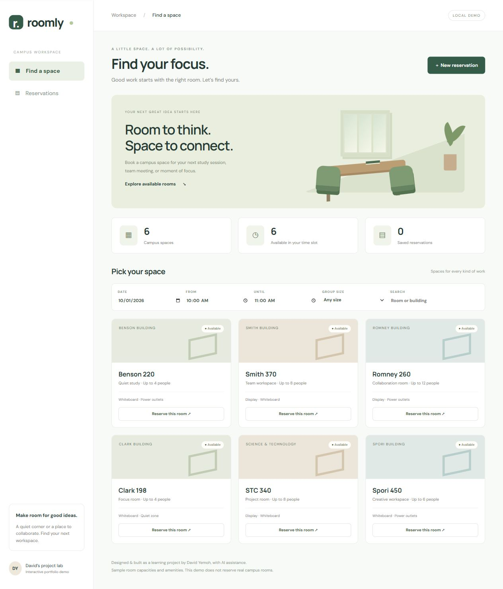
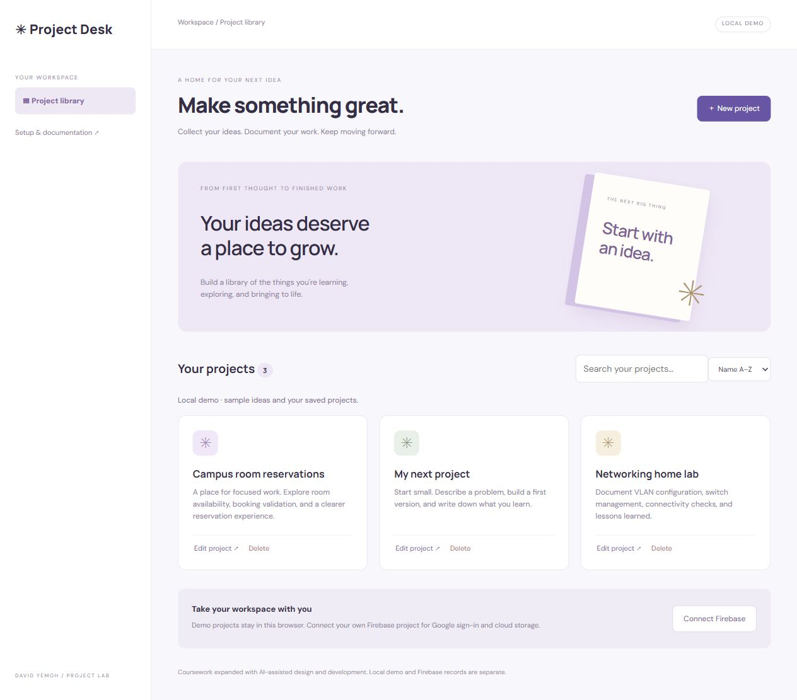

# David Yemoh — IT Project Lab

Computer Information Technology student at BYU–Idaho · Class of 2028 · Security+ · eJPT

Three projects exploring application development, networking, and troubleshooting.

## Room reservations

Python and SQLite booking logic with automated tests, plus a responsive web demo. The browser demo and Python database are currently separate.

[Explore the project and run it locally](room-reservations/README.md)

## Firebase Project Desk

A searchable project notebook with a tested local demo and Firebase integration prepared for configuration and live testing.

[Explore the project and setup guide](firebase-project-desk/README.md)

## Networking lab

Cisco switch management, VLAN configuration, and connectivity checks documented from a home lab. Fresh screenshots are pending.

[Read the lab documentation](networking-lab/README.md)

## Project history

These projects include coursework, starter material, personal contributions, and AI-assisted improvements. See [project history and attribution](PROJECT-HISTORY.md) for details.

[GitHub profile](https://github.com/dyemoh1) · [LinkedIn](https://www.linkedin.com/in/david-yemoh-479b7a281/)
